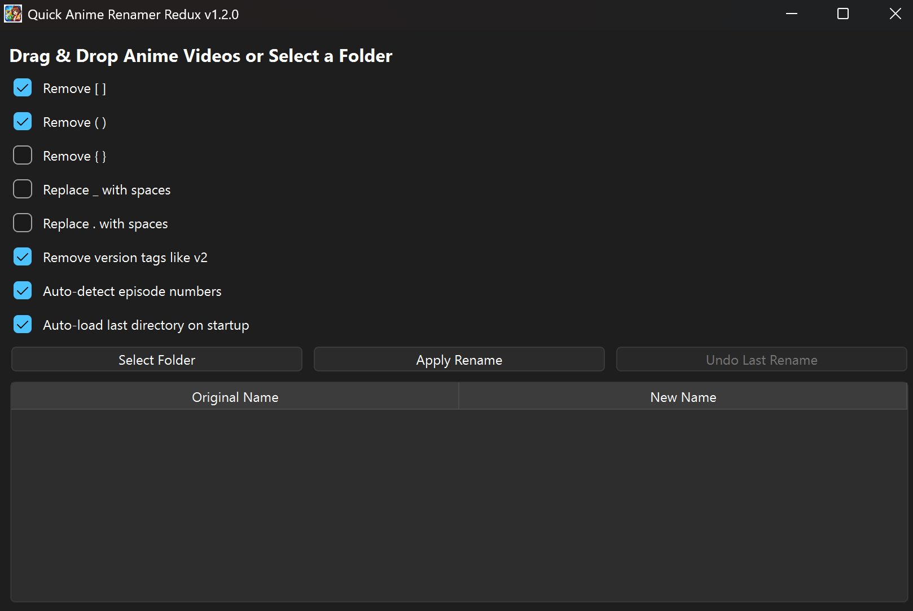

# Quick Anime Renamer Redux



A modern Windows revival of **Quick Anime Renamer**.

## Features
- Drag and drop anime videos
- Folder batch renaming
- Two-column preview
- Smart episode detection
- Removes standalone version tags like `v2` and `v3`
- Auto-load last directory on startup
- Delete key removes files from the current batch
- Filename conflict detection
- Remember window size and position
- Remembers settings
- Native light and dark mode

| Original filename                              | Renamed filename                   |
| ---------------------------------------------- | ---------------------------------- |
| `[Judas] Chained Soldier - S02E06.mkv`         | **Chained Soldier - S02 - 06.mkv** |
| `Jujutsu Kaisen S01E03.mkv`                    | **Jujutsu Kaisen - S01 - 03.mkv**  |
| `[SubsPlease] Yuusha no Kuzu - 06 (1080p).mkv` | **Yuusha no Kuzu - 06.mkv**        |
| `One_Piece_-_1092_[1080p].mkv`                 | **One Piece - 1092.mkv**           |
| `Spirited Away (2001).mkv`                     | **Spirited Away.mkv**              |
| `Akira.1988.1080p.mkv`                         | **Akira.mkv**                      |

## Credits
Created by **Justin Morland**  
Inspired by the original *Quick Anime Renamer* by **Joshua Park**  
Not affiliated with the original project.

## Build
Requires Python 3.10+ and PySide6.

```powershell
pip install pyside6 pyinstaller
python -m PyInstaller --onefile --windowed --icon=quick_anime_renamer_redux.ico --add-data "quick_anime_renamer_redux.ico;." quick_anime_renamer_redux.py
```
